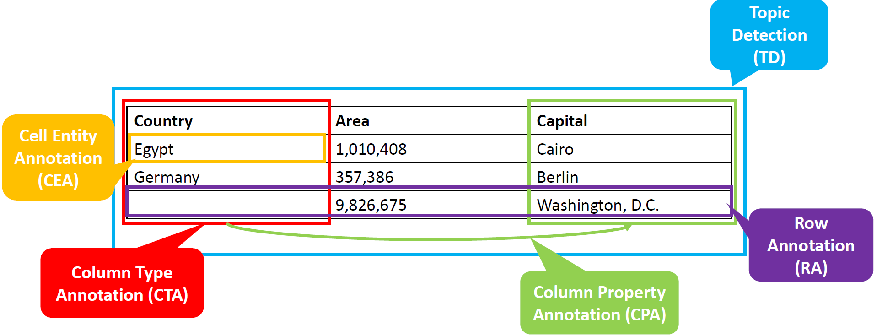
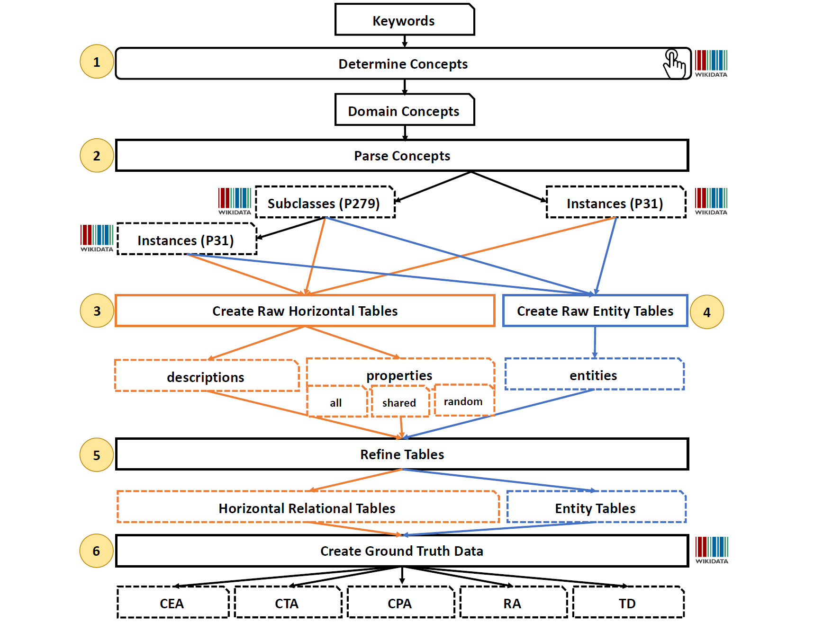

# Wikidata2Tables Service

This service provides the proxy to Wikidata KG (Lookup API + Sparql Endpoint) to generate a domain-specific Semantic Table Annotation (STA) benchmarks.
* **tFood** [](https://doi.org/10.5281/zenodo.10048187)
  * This dataset has been generated by this generator code
  * tFood is made public for the first time during [SemTab 2023 - Round 1](https://sem-tab-challenge.github.io/2023/)

## Generation Method

### Semantic Table Interpretation/Annotation (STI/STA) 
* STI or STA is the task of annotating tabular data semantically using Knowledge Graphs (KGs)
* The following image represent the summary of the 5 state-of-the-art tasks for STI
  * **CEA** - Cell Entity Annotation: Assigns table cells to entities from KGs
  * **CTA** - Colum Type Annotation: Maps table columns to semantic types or classes from KGs
  * **CPA** - Colum-column Property Annotation: Links table columns (subject-object) with properties or predicates from KGs
  * **RA** - Row Annotation: Links rows from table to an entities from KGs
    * Could be seen as a special version of CEA but the major difference is the absence of the subject cell (usually the first cell of the row)
  * **TD** - Topic Detection: Annotates the entire tables with entities or classes from KGs 



### tFood Generation Method
* The following image represents the generation method adopted in the Generator Code in this repo.
* To generate a large scale dataset that is derived from the `Food` domain, we followed the next steps:
  * We determined the relevant `Keywords`, e.g., sandwich, meal, breakfast, pizza, ...etc. that are commonly used in normal menus
  * We looked up these keywords in Wikidata and created `data\input\categories.csv`, this step yield `Domain Concepts` (entities + classes)
  * We parse the given categories via their instances and subclasses their next level in the hierarchy (recursive manner)
  * We constructed Horizontal and Entity tables for the retrieved instances and subclasses
  * The creation method is done based (descriptions (long text in Wikidata), properties, or the entities themselves) or the combination among all of them
  * The following step included tables refinement, it cleans the tables entries that are impossible to annotate 
    * e.g., remove a row that is annotated as sandwich given only a country name (Italy might contain 1000 sandwich, so, it is impossible for a system, even a human, determine that the correct class of Italy is Sandwich)
    * This step also contains the table header and names anonymization using random characters and numbers
  * The last step is the creation of the ground truth format that splits the actual tables to be annotated from the STI answers



## Quick Setup 

* Make sure that the desired categories are under `data\input\categories.csv`
* ```hypercorn main:app -c python:asgi_config.py```


## Endpoints
| Name                         | Type | Description                                                                                      |
|------------------------------|------|--------------------------------------------------------------------------------------------------|
| `generate_benchmark_at_once` | POST | On hot button for creating a domain-specific benchmark based on the given `input/categories.csv` |
| `generate_tables`            | POST | Generates both `Entity` and `Horizontal` tables for the corresponding categories.csv             |
| `anonymize_tables`           | POST | Rename tables' names using follow a certain sequence  e.g., Q50 --> UUT10                        |
| `count`                      | GET  | Provides tables' count for each entity and horizontal tables                                     |


### `generate_benchmark_at_once` Output format

```json
{
  "message": "Success or error message of creating benchmark",
  "counts": {
                "Entity Tables": "Number of created entity tables",
                "Horizontal Tables": "Number of created horizontal tables",
                "Total": "Number of created entity + horizontal tables"  
            }
}
```


### `generate_tables` Output format


```json
{
  "message": "Success or error message of creating benchmark"
}
```

### `anonymize_tables` Output format

```json
{
  "message": "Success or error message of creating benchmark"
}
```

### `count` Output format

```json
{
    "Entity Tables": "Number of created entity tables",
    "Horizontal Tables": "Number of created horizontal tables",
    "Total": "Number of created entity + horizontal tables"     
}
```

## Configuration

Environment variables for configuration (can also be set via docker-compose.yml):

| Name                           | Default                              | Description                                                                           |
|--------------------------------|--------------------------------------|---------------------------------------------------------------------------------------|
| MAX_PARALLEL_REQUESTS          | 5                                    | maximum number of parallel requests. Used to prevent IP-bans from Wikidata            |
| DEFAULT_DELAY                  | 10                                   | default delay upon HTTP error (429, 500, ...); in seconds                             |
| MAX_RETRIES                    | 5                                    | maximum number of retries upon HTTP errors                                            |
| wikidata_SPARQL_ENDPOINT       | 'https://query.wikidata.org/sparql'  | Wikidata endpoint that hits to construct the benchmark                                |

## Citation
```commandline
@dataset{tfood_zenodo_oct23,
  author       = {Nora Abdelmageed and
                  Ernesto Jimènez-Ruiz and
                  Oktie Hassanzadeh and
                  Birgitta König-Ries},
  title        = {{tFood: Semantic Table Annotations Benchmark for 
                   Food Domain}},  
  year         = 2023,  
  doi          = {10.5281/zenodo.10048187},
  url          = {https://doi.org/10.5281/zenodo.10048187}
}
```